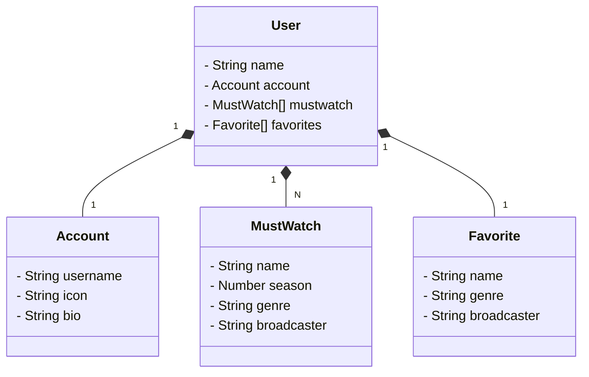

# SB-dio-Desafio-api
RESTful API para desafio de projeto da Digital Innovation One criada em Java 18 com Spring Boot 3.1.4

## Diagrama de Classes

```mermaid

classDiagram
  class User {
    - String name
    - Account account
    - MustWatch[] mustwatch
    - Favorite[] favorites
  }

  class Account {
    - String username
    - String icon
    - String bio
  }

  class MustWatch {
    - String name
    - Number season
    - String genre
    - String broadcaster
  }

  class Favorite {
    - String name
    - String genre
    - String broadcaster
  }

  User "1" *-- "1" Account
  User "1" *-- "N" MustWatch
  User "1" *-- "1" Favorite
```
