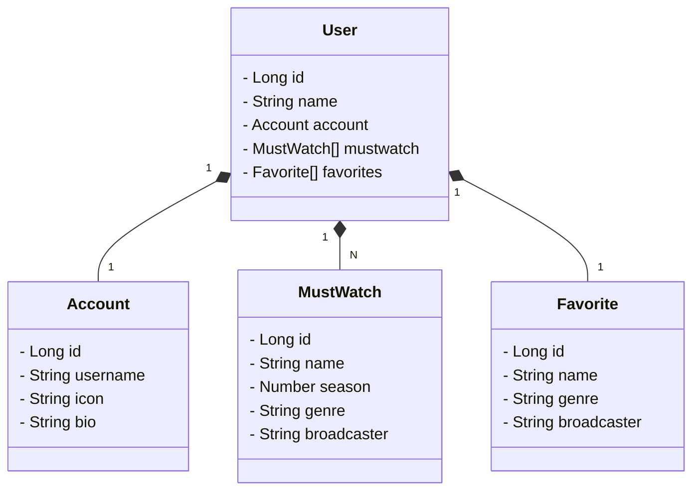

# Desafio-api-dio-santander-bootcamp
RESTful API para desafio de projeto da Digital Innovation One criada em Java 17 com Spring Boot 3.1.4

# Principais tecnologias utilizadas
+ Java 17
+ Spring Boot 3.1.4
+ Spring Web
+ Spring JPA Data
+ Open API (Swagger)
+ Railway

## Diagrama de Classes

# Documentação da API (Swagger)

Disponível em [http://sb-dio-desafio-api-production.up.railway.app](https://sb-dio-desafio-api-production.up.railway.app/swagger-ui/index.html)

# URL de produção

https://sb-dio-desafio-api-production.up.railway.app/users/1
